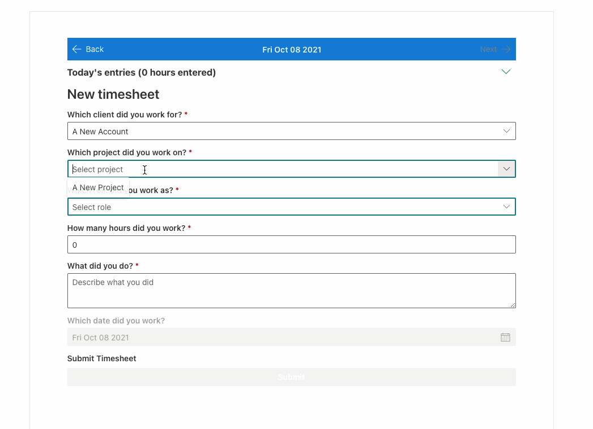

# timesheets-webpart

## Summary

This webpart provides a front-end view for a timesheets application. It consists of a section listing existing timesheet entries with a form below
to add new entries accordingly.

## Used SharePoint Framework Version

SPFx v1.12.1

## Applies to

- [SharePoint Framework](https://aka.ms/spfx)
- [Microsoft 365 tenant](https://docs.microsoft.com/en-us/sharepoint/dev/spfx/set-up-your-developer-tenant)

> Get your own free development tenant by subscribing to [Microsoft 365 developer program](http://aka.ms/o365devprogram)

## Prerequisites

This webpart interfaces with SharePoint lists to read and store data. You must first setup a SharePoint site with these lists. See our ready-made
site script and deployment instructions here: https://github.com/MRSCompanyLtd/SPSiteScripts.

Once that site is setup you can deploy the webpart and start using it. Please note for Teams support, the site URL is hardcoded at line 28 of services/sp.ts. Edit this as required.

## Solution

Timesheets Webpart
-------------------
MRS Company Ltd.
Toronto, ON, Canada

Website: https://mrscompany.com
Twitter: https://twitter.com/_MRSCompanyLtd
LinkedIn: https://www.linkedin.com/company/m-r-s--company-ltd-/
Github: https://github.com/MRSCompanyLtd

## Version history

Version|Date|Comments
-------|----|--------
1 | October 8, 2021 | Initial commit

## Disclaimer

**THIS CODE IS PROVIDED *AS IS* WITHOUT WARRANTY OF ANY KIND, EITHER EXPRESS OR IMPLIED, INCLUDING ANY IMPLIED WARRANTIES OF FITNESS FOR A PARTICULAR PURPOSE, MERCHANTABILITY, OR NON-INFRINGEMENT.**

## Minimal Path to Awesome

- Clone this repository
- Ensure that you are at the solution folder
- in the command-line run:
  - **npm install**
  - **gulp serve**
- Deploy to app catalog
- Add to site

## Features

This webpart illustrates the following concepts:

- Work with React SPFx Functional Components
- Call PnP SP and Graph APIs
- Microsoft Fabric UI for React